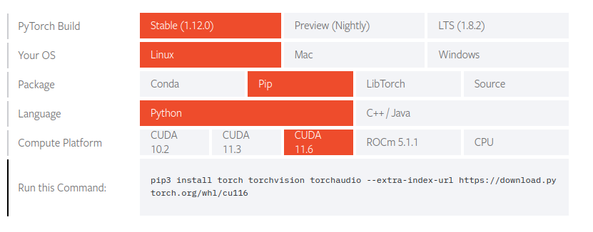

# 无人车交通信号recognition

准备工作
windows 或linux（ubuntu）环境。算力（1050 2G here）
助教给的数据集、yolo5现成代码、指南。
网关翻墙
git。注意gitignore图片。还可以保密。

环境配置
pip install -r requirement.txt
使用nvidia显卡训练是常见的。nvidia-smi查看cuda版本，一般为11.6
先
https://pytorch.org/get-started/locally/

---

开始训练
设置一些arguments。
parser.add_argument('--cfg', default='models/yolov5s.yaml', )
parser.add_argument('--batch-size',default=16,)
TensorBoard: Start with 'tensorboard --logdir runs/train', view at http://localhost:6006/

---

train: weights=yolov5s.pt, cfg=models/yolov5s.yaml, data=data/aicar.yaml, hyp=data/hyps/hyp.scratch-low.yaml, epochs=30, batch_size=16, imgsz=640, rect=False, resume=False, nosave=False, noval=False, noautoanchor=False, noplots=False, evolve=None, bucket=, cache=None, image_weights=False, device=0, multi_scale=False, single_cls=False, optimizer=SGD, sync_bn=False, workers=0, project=runs/train, name=exp, exist_ok=False, quad=False, cos_lr=False, label_smoothing=0.0, patience=100, freeze=[0], save_period=-1, local_rank=-1, entity=None, upload_dataset=False, bbox_interval=-1, artifact_alias=latest
github: up to date with https://github.com/han3345/yolov5 ✅
YOLOv5 🚀 d8e3492 Python-3.10.4 torch-1.12.0+cu116 CUDA:0 (NVIDIA GeForce GTX 1050, 1998MiB)

hyperparameters: lr0=0.01, lrf=0.01, momentum=0.938, weight_decay=0.0005, warmup_epochs=4.0, warmup_momentum=0.9, warmup_bias_lr=0.1, box=0.05, cls=0.5, cls_pw=1.0, obj=1.0, obj_pw=1.0, iou_t=0.2, anchor_t=4.0, fl_gamma=0.0, hsv_h=0.015, hsv_s=0.7, hsv_v=0.4, degrees=0.0, translate=0.1, scale=0.5, shear=0.0, perspective=0.0, flipud=0.0, fliplr=0.5, mosaic=1.0, mixup=0.0, copy_paste=0.0

Weights & Biases: run 'pip install wandb' to automatically track and visualize YOLOv5 🚀 runs (RECOMMENDED)
TensorBoard: Start with 'tensorboard --logdir runs/train', view at http://localhost:6006/

Overriding model.yaml nc=80 with nc=6 //number of classes

                 from  n    params  module                                  arguments                     
  0                -1  1      3520  models.common.Conv                      [3, 32, 6, 2, 2]              
  1                -1  1     18560  models.common.Conv                      [32, 64, 3, 2]                
  2                -1  1     18816  models.common.C3                        [64, 64, 1]                   
  3                -1  1     73984  models.common.Conv                      [64, 128, 3, 2]               
  4                -1  2    115712  models.common.C3                        [128, 128, 2]                 
  5                -1  1    295424  models.common.Conv                      [128, 256, 3, 2]              
  6                -1  3    625152  models.common.C3                        [256, 256, 3]                 
  7                -1  1   1180672  models.common.Conv                      [256, 512, 3, 2]              
  8                -1  1   1182720  models.common.C3                        [512, 512, 1]                 
  9                -1  1    656896  models.common.SPPF                      [512, 512, 5]                 
 10                -1  1    131584  models.common.Conv                      [512, 256, 1, 1]              
 11                -1  1         0  torch.nn.modules.upsampling.Upsample    [None, 2, 'nearest']          
 12           [-1, 6]  1         0  models.common.Concat                    [1]                           
 13                -1  1    361984  models.common.C3                        [512, 256, 1, False]          
 14                -1  1     33024  models.common.Conv                      [256, 128, 1, 1]              
 15                -1  1         0  torch.nn.modules.upsampling.Upsample    [None, 2, 'nearest']          
 16           [-1, 4]  1         0  models.common.Concat                    [1]                           
 17                -1  1     90880  models.common.C3                        [256, 128, 1, False]          
 18                -1  1    147712  models.common.Conv                      [128, 128, 3, 2]              
 19          [-1, 14]  1         0  models.common.Concat                    [1]                           
 20                -1  1    296448  models.common.C3                        [256, 256, 1, False]          
 21                -1  1    590336  models.common.Conv                      [256, 256, 3, 2]              
 22          [-1, 10]  1         0  models.common.Concat                    [1]                           
 23                -1  1   1182720  models.common.C3                        [512, 512, 1, False]          
 24      [17, 20, 23]  1     29667  models.yolo.Detect                      [6, [[10, 13, 16, 30, 33, 23], [30, 61, 62, 45, 59, 119], [116, 90, 156, 198, 373, 326]], [128, 256, 512]]
[W NNPACK.cpp:51] Could not initialize NNPACK! Reason: Unsupported hardware.
YOLOv5s summary: 270 layers, 7035811 parameters, 7035811 gradients, 16.0 GFLOPs

Transferred 342/349 items from yolov5s.pt
AMP: checks passed ✅
Scaled weight_decay = 0.0005
optimizer: SGD with parameter groups 57 weight (no decay), 60 weight, 60 bias
train: Scanning '/home/han/Desktop/yolov5/data/train.cache' images and labels... 426 found, 0 missing, 0 empty, 0 corrupt: 100%|██████████| 426/426 [00:00<?, ?it/s]                       
val: Scanning '/home/han/Desktop/yolov5/data/test.cache' images and labels... 1511 found, 0 missing, 0 empty, 0 corrupt: 100%|██████████| 1511/1511 [00:00<?, ?it/s]                       
Plotting labels to runs/train/exp25/labels.jpg... 

AutoAnchor: 5.20 anchors/target, 0.998 Best Possible Recall (BPR). Current anchors are a good fit to dataset ✅
Image sizes 640 train, 640 val
Using 0 dataloader workers
Logging results to runs/train/exp25
Starting training for 30 epochs...

---

